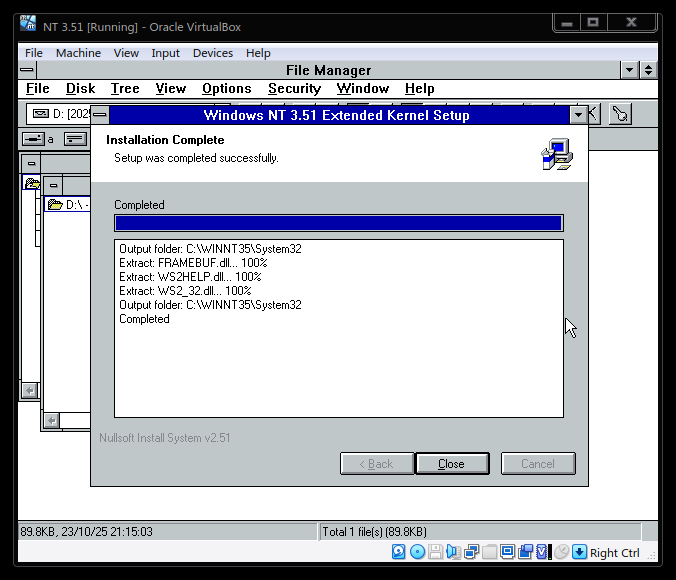

<h1>NT 3.51 KernelEx</h1>

<h2>STILL EXTREMELY WORK IN PROGRESS!! DO NOT USE IT ON A MAIN MACHINE!!</h2>

Credits:

<h2>System file backports:</h2>
<ul>
<li>
Native WS2 support: <a href="https://github.com/DaniElectra/winsock351">DaniElectra's WinSock2 implementation</a>
</li>

<li>
DirectDraw implementation: <a href="https://www.winhistory-forum.net/thread/6370-das-pimp-my-nt3-51-projekt/?pageNo=7">WinHistory forum (exclusively in German)</a>
</li>
</ul>
<h2>Custom drivers</h2>
<ul>
<li>
Universal SATA driver: <a href="https://alter.org.ua/en/soft/win/uni_ata/index.php">alter.org.ua</a>
</li>

<li>
Large drive support: <a href="https://alter.org.ua/soft/nt_spack/nt3/">alter.org.ua</a>
</li>
</ul>